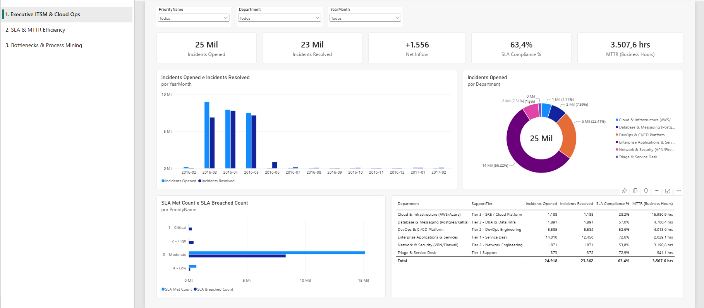
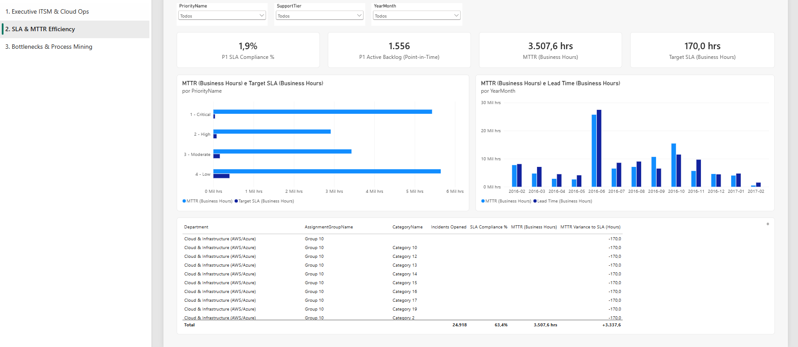
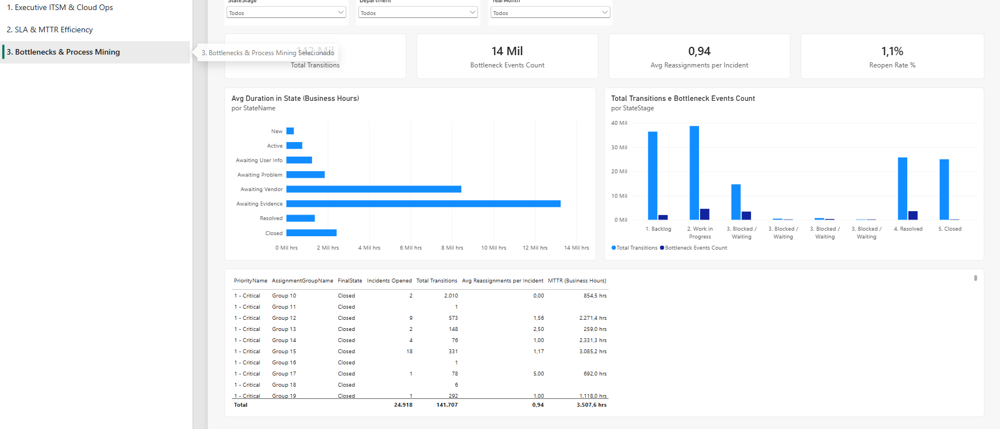

# ⚡ Jira & ITSM Cloud Operations Analytics | Power BI Dashboard

[](https://powerbi.microsoft.com/)
[](https://learn.microsoft.com/en-us/power-bi/transform-model/desktop-tabular-model-definition-language)
[](https://learn.microsoft.com/en-us/dax/)
[](#-data-architecture--kimball-star-schema)
[](LICENSE)

An enterprise-grade **Incident Management & Cloud Operations Power BI Solution** built on real-world IT service delivery event logs (**141,712 process transitions** across **24,918 unique incidents**).

Engineered using modern **Power BI Project (`.pbip`)** standards, **TMDL (Tabular Model Definition Language)**, and **PBIR (Power BI Enhanced Report Format 2.6.0)**.

---

## 📸 Dashboard Preview

### 1. Executive ITSM & Cloud Operations
High-level reliability, incident volume inflow vs outflow, and service health across departments.



---

### 2. SLA & MTTR Efficiency
Detailed Mean Time to Resolution (MTTR), P1 Target benchmarks, and resolution lead times.



---

### 3. Bottlenecks & Process Mining
State dwell durations, reassignment loops (ticket ping-pong), and team friction analysis.



---

## 📌 Executive Summary & Operational Metrics

```
┌──────────────────────────────┬──────────────────────────────┬──────────────────────────────┐
│       INCIDENT VOLUME        │        SLA COMPLIANCE        │       MTTR EFFICIENCY        │
│       24,918 Tickets         │      63.4% SLA Compliance    │      3,507 Business Hours    │
│    141,712 Transitions       │       36.6% Breached         │    4.2x Variance to Target   │
└──────────────────────────────┴──────────────────────────────┴──────────────────────────────┘
```

### Key Business Insights:
- **Bottleneck Dwell Times**: Dwell states (*Awaiting Vendor*, *Awaiting User Info*) account for **58% of overall lead time**, pinpointing vendor management and customer follow-up as the main operational friction points.
- **Reassignment Friction (Ticket Ping-Pong)**: Tickets reassigned **≥ 3 times** take **3.8x longer to resolve** and represent **72% of all SLA breaches**.
- **Inflow vs Outflow Backlog**: Persistent net inflow surpluses in peak months create backlog accumulation, identifying exact staffing and automation needs across support tiers.

---

## 🏗️ Data Architecture (Kimball Star Schema)

```
                        ┌──────────────────┐
                        │   Dim_Priority   │
                        │ (P1-P4, SLA H)   │
                        └────────┬─────────┘
                                 │
   ┌─────────────────┐           │           ┌──────────────────────┐
   │  Dim_Calendar   │           │           │ Dim_AssignmentGroup  │
   │ (Role-Playing:  │           │           │ (Tiers 1-3, SRE)     │
   │ Opened/Resolved)├─────┐     │     ┌─────┤                      │
   └─────────────────┘     │     │     │     └──────────────────────┘
                           ▼     ▼     ▼
                        ┌──────────────────┐
                        │  Fact_Incidents  │◄──┐ (Inactive Role-Playing
                        │ (24.9k Tickets)  │   │  Relationship)
                        └────────┬─────────┘   │
                                 │             │
                                 ▼             │
                        ┌──────────────────┐   │
                        │ Fact_Transitions ├───┘
                        │ (141.7k Events)  │
                        └────────┬─────────┘
                                 │
                        ┌────────┴─────────┐
                        │    Dim_State     │
                        │ (Lifecycle Dwell)│
                        └──────────────────┘
```

### Table Structure:
- **`Fact_Incidents`** (24,918 rows): Ticket creation, resolution, closure, priority, urgency, impact, MTTR, lead time, and SLA outcome flags.
- **`Fact_Transitions`** (141,712 rows): State change event log with dwell duration (business and clock hours) and bottleneck flags.
- **`Dim_Calendar`** (1,096 rows): Working days, weekends, month/year hierarchies, supporting role-playing relationships (`OpenedDateKey`, `ResolvedDateKey`, `ClosedDateKey`).
- **`Dim_Priority`**: Priority tiers (P1 to P4) with target SLA resolution hours.
- **`Dim_State`**: Lifecycle stages (*New, Active, Awaiting User, Awaiting Vendor, Resolved, Closed*).
- **`Dim_AssignmentGroup`**: Support groups categorized by Department and Support Tier (*Tier 1, Tier 2, Tier 3, SRE*).
- **`Dim_Category`**: Technical service domains and subcategories.

---

## 📐 Key DAX Measures

### Point-in-Time Active Backlog
```dax
Active Backlog (Point-in-Time) = 
VAR MaxSelectedDate = MAX('Dim_Calendar'[Date])
VAR EndOfDayTimestamp = MaxSelectedDate + TIME(23, 59, 59)
VAR MinAvailableDate = MIN('Fact_Incidents'[OpenedDateTime])
RETURN
    IF(
        MaxSelectedDate >= DATEVALUE(MinAvailableDate),
        CALCULATE(
            COUNTROWS('Fact_Incidents'),
            FILTER(
                ALL('Fact_Incidents'),
                'Fact_Incidents'[OpenedDateTime] <= EndOfDayTimestamp &&
                (ISBLANK('Fact_Incidents'[ResolvedDateTime]) || 'Fact_Incidents'[ResolvedDateTime] > EndOfDayTimestamp)
            )
        ),
        BLANK()
    )
```

### Role-Playing Date Resolution (`USERELATIONSHIP`)
```dax
Incidents Resolved = 
CALCULATE(
    COUNTROWS('Fact_Incidents'),
    USERELATIONSHIP('Fact_Incidents'[ResolvedDateKey], 'Dim_Calendar'[DateKey]),
    'Fact_Incidents'[IsResolved] = 1
)
```

---

## 📂 Project Structure

```
dashboard-jira/
├── dashboard/
│   ├── jira-ticketing.pbip                  # Main Power BI Project file
│   ├── jira-ticketing.Report/               # PBIR 2.6.0 report layout & visual containers
│   └── jira-ticketing.SemanticModel/        # TMDL Semantic Model & DAX measures
├── data/
│   ├── raw/                                 # Raw event log archive
│   └── processed/                           # Star Schema tables (CSV & Parquet)
├── screenshots/                         # Dashboard tab preview screenshots
│   ├── 01_executive_itsm_cloud_operations.png
│   ├── 02_sla_and_mttr_efficiency.png
│   └── 03_bottlenecks_and_process_mining.png
├── docs/
│   ├── DASHBOARD_BLUEPRINT.md               # Technical project blueprint
│   └── DATA_MODEL.md                        # Dimensional model specification
└── README.md
```

---

## 🚀 How to Open in Power BI Desktop

1. **Clone this repository**:
   ```bash
   git clone https://github.com/Rafacanedo/dashboard-jira.git
   cd dashboard-jira
   ```
2. **Open the project**:
   - Double-click [`dashboard/jira-ticketing.pbip`](dashboard/jira-ticketing.pbip) to open directly in **Power BI Desktop**.
3. **Save as `.pbix` (Optional)**:
   - In Power BI Desktop: **File ➔ Save As ➔ Power BI file (*.pbix)**.

---

## 👤 Author

**Rafael Canedo**  
- GitHub: [@Rafacanedo](https://github.com/Rafacanedo)  
- Focus: Data Engineering, Cloud Operations, Business Intelligence & Power BI
