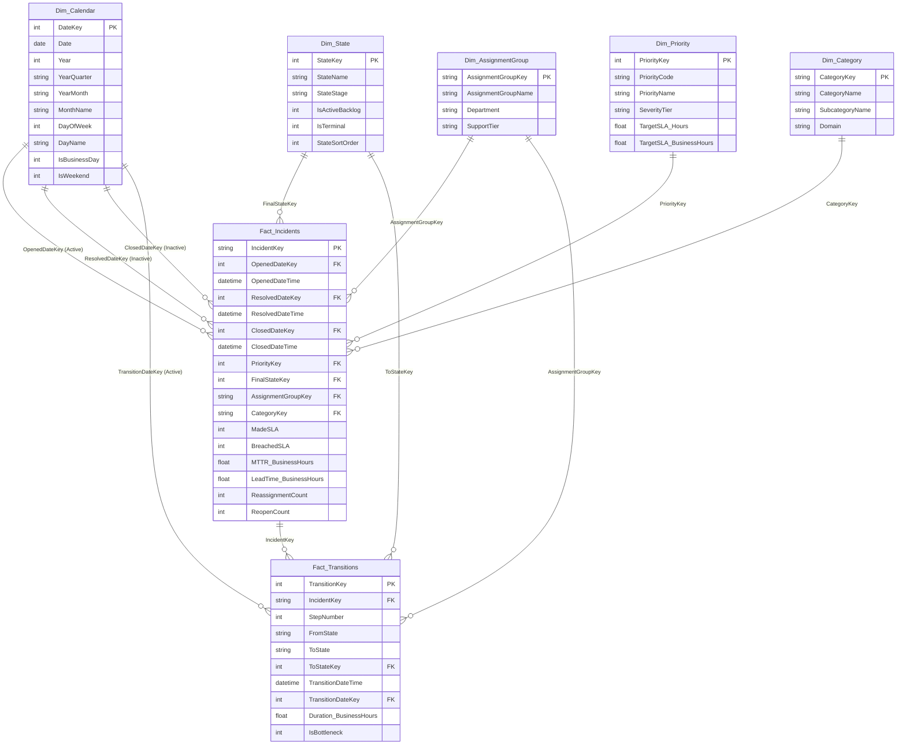

# Data Model Architecture & Schema Documentation

## 1. Overview & Architecture Pattern

This data model follows a Kimball-style **Star Schema** with two central fact tables representing distinct business granularities and five supporting dimension tables:

1. **`Fact_Incidents`**: Ticket-level grain (1 row per unique incident). Captures opened/resolved/closed timestamps, SLA status, churn metrics, and end-to-end resolution durations.
2. **`Fact_Transitions`**: Event-level audit changelog grain (1 row per status change). Captures the lifecycle path, durations spent in each state, and operational bottlenecks.



---

## 2. Relationship Specifications

| From Table | From Column | To Table | To Column | Cardinality | Cross Filter | State in Model | Purpose |
| :--- | :--- | :--- | :--- | :--- | :--- | :--- | :--- |
| `Fact_Incidents` | `OpenedDateKey` | `Dim_Calendar` | `DateKey` | Many to One (`*:1`) | Single | **Active** | Primary date context for tickets created. |
| `Fact_Incidents` | `ResolvedDateKey` | `Dim_Calendar` | `DateKey` | Many to One (`*:1`) | Single | **Inactive** | Activated via `USERELATIONSHIP` for resolution trends. |
| `Fact_Incidents` | `ClosedDateKey` | `Dim_Calendar` | `DateKey` | Many to One (`*:1`) | Single | **Inactive** | Activated via `USERELATIONSHIP` for closure/lead time. |
| `Fact_Incidents` | `PriorityKey` | `Dim_Priority` | `PriorityKey` | Many to One (`*:1`) | Single | **Active** | Slice by Priority (P1–P4) & contracted SLA targets. |
| `Fact_Incidents` | `FinalStateKey` | `Dim_State` | `StateKey` | Many to One (`*:1`) | Single | **Active** | Filter by final status stage. |
| `Fact_Incidents` | `AssignmentGroupKey` | `Dim_AssignmentGroup` | `AssignmentGroupKey` | Many to One (`*:1`) | Single | **Active** | Department & support tier attribution. |
| `Fact_Incidents` | `CategoryKey` | `Dim_Category` | `CategoryKey` | Many to One (`*:1`) | Single | **Active** | Technical domain breakdown. |
| `Fact_Transitions` | `IncidentKey` | `Fact_Incidents` | `IncidentKey` | Many to One (`*:1`) | Single | **Inactive** | Eliminates ambiguous path loop with Dim_Calendar. Available for explicit DAX `USERELATIONSHIP`. |
| `Fact_Transitions` | `TransitionDateKey` | `Dim_Calendar` | `DateKey` | Many to One (`*:1`) | Single | **Active** | Audit timeline & transition date analysis. |
| `Fact_Transitions` | `ToStateKey` | `Dim_State` | `StateKey` | Many to One (`*:1`) | Single | **Active** | Dwell duration in each lifecycle state. |
| `Fact_Transitions` | `AssignmentGroupKey` | `Dim_AssignmentGroup` | `AssignmentGroupKey` | Many to One (`*:1`) | Single | **Active** | Team attribution at time of transition. |

---

## 3. Advanced Modeling Challenges Solved

### A. Role-Playing Date Dimensions (`USERELATIONSHIP`)
A single incident records three critical chronological milestones: `OpenedDateTime`, `ResolvedDateTime`, and `ClosedDateTime`. In a relational model, creating multiple active relationships between `Fact_Incidents` and `Dim_Calendar` causes relationship ambiguity. 

* **Solution**: Keep `OpenedDateKey` as the single active relationship. All measures tracking resolutions and closures explicitly invoke:
  ```dax
  USERELATIONSHIP('Fact_Incidents'[ResolvedDateKey], 'Dim_Calendar'[DateKey])
  ```
  This allows a single date slicer to drive both Inflow and Outflow simultaneously on the same visual.

### B. Point-in-Time Non-Additive Backlog
Standard Power BI sums cannot tell you how many tickets were open on March 15th, 2016. Adding daily open tickets across months would cause severe double-counting (non-additive metric).

* **Solution**: Semi-additive DAX logic evaluating whether each incident was opened on or before the boundary timestamp ($T_{\text{max}}$) and remained unresolved at that timestamp ($T_{\text{resolved}} > T_{\text{max}} \lor \text{ISBLANK}(T_{\text{resolved}})$):
  ```dax
  CALCULATE(
      COUNTROWS('Fact_Incidents'),
      FILTER(
          ALL('Fact_Incidents'),
          'Fact_Incidents'[OpenedDateTime] <= MaxSelectedDate + TIME(23, 59, 59) &&
          (
              ISBLANK('Fact_Incidents'[ResolvedDateTime]) ||
              'Fact_Incidents'[ResolvedDateTime] > MaxSelectedDate + TIME(23, 59, 59)
          )
      )
  )
  ```

### C. True Business-Hour Calculations
Incidents submitted at 4:30 PM on a Friday and resolved at 9:30 AM on Monday reflect **1 hour of working engineering time**, but **65 clock hours**. 
* The ETL pre-computes business hours ($M-F, 09:00 - 17:00$) at ingestion using vectorized calendar operations.
* Power BI displays both `MTTR_ClockHours` (for raw SLA uptime) and `MTTR_BusinessHours` (for engineering capacity efficiency).
